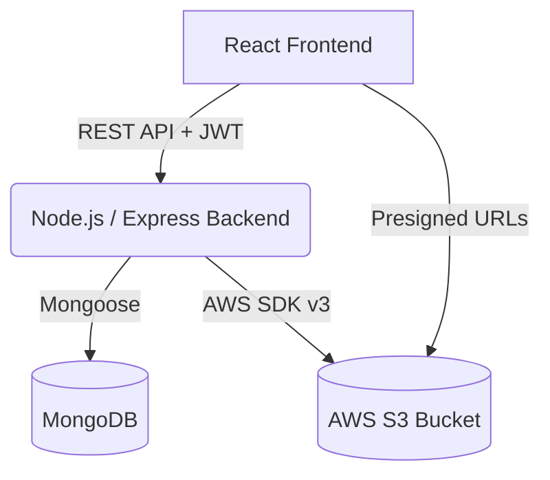

# Cloud Vault

A production-ready Cloud File Management System built with React, Node.js, MongoDB, and AWS S3.

## Architecture Diagram



## Tech Stack
- **Frontend**: React, Vite, React Router DOM, Axios, Lucide React, Vanilla CSS (Glassmorphism)
- **Backend**: Node.js, Express, Mongoose, JWT, Bcrypt, Multer, AWS SDK v3
- **Database**: MongoDB Atlas
- **Storage**: AWS S3
- **CI/CD**: GitHub Actions

## Features
- Secure JWT-based Authentication
- File Upload (direct to S3 via backend)
- File Listing with Metadata & Icons
- Secure File Download via Pre-signed URLs
- File Deletion (S3 & MongoDB sync)
- Premium Dark Mode Glassmorphism UI

---

## 10-Step Beginner Deployment Guide

Follow these steps to deploy Cloud Vault from scratch:

### 1. Create a MongoDB Atlas Cluster
- Go to [MongoDB Atlas](https://www.mongodb.com/cloud/atlas) and sign up.
- Create a free shared cluster.
- In Database Access, create a user with a password.
- In Network Access, allow access from anywhere (`0.0.0.0/0`).
- Click "Connect" -> "Connect your application" and copy the `MONGO_URI`.

### 2. Set Up AWS Account & S3 Bucket
- Go to [AWS Console](https://aws.amazon.com/) and create an account.
- Search for "S3" and create a new bucket for files (e.g., `my-cloud-vault-files`).
- Keep "Block all public access" checked for secure pre-signed URLs (recommended).
- Enable CORS in the bucket permissions to allow your frontend URL.

### 3. Create AWS IAM User
- Go to "IAM" in AWS Console.
- Create a new User (e.g., `cloud-vault-app`).
- Attach policy directly: `AmazonS3FullAccess` (or create a custom policy restricted to your bucket).
- Go to Security Credentials for the user and create an **Access Key**. Save the `Access Key ID` and `Secret Access Key`.

### 4. Configure Local Environment
- Clone the repository.
- Rename `.env.example` to `.env` in the root folder.
- Fill in the values for `MONGO_URI`, `AWS_REGION`, `AWS_ACCESS_KEY_ID`, `AWS_SECRET_ACCESS_KEY`, and `AWS_S3_BUCKET_NAME`.
- Generate a random string for `JWT_SECRET`.

### 5. Deploy Backend to Render (or Heroku)
- Push your code to GitHub.
- Go to [Render.com](https://render.com/) and create a new "Web Service".
- Connect your GitHub repository and select the `backend` folder as the Root Directory.
- Set Build Command: `npm install`
- Set Start Command: `npm start`
- Add all the Environment Variables from your `.env` file into Render's Environment section.
- Deploy and copy the Render URL (e.g., `https://cloud-vault-backend.onrender.com`).

### 6. Configure Frontend Environment
- In `frontend/.env` (create it), set `VITE_API_URL=https://cloud-vault-backend.onrender.com/api`.
- Push the changes to GitHub.

### 7. Configure GitHub Actions for Frontend S3 Deployment
- Go to your GitHub Repository -> Settings -> Secrets and variables -> Actions.
- Add the following Repository Secrets:
  - `AWS_ACCESS_KEY_ID`: Your AWS Access Key.
  - `AWS_SECRET_ACCESS_KEY`: Your AWS Secret.
  - `AWS_S3_BUCKET`: The name of another S3 bucket specifically for hosting your React build (e.g., `cloud-vault-frontend-hosting`).

### 8. Set Up Frontend Hosting Bucket
- In AWS S3, create the `cloud-vault-frontend-hosting` bucket.
- Uncheck "Block all public access".
- Go to Properties -> Static website hosting -> Enable. Set index document to `index.html`.
- Go to Permissions -> Bucket Policy and allow public read access:
  ```json
  {
      "Version": "2012-10-17",
      "Statement": [
          {
              "Sid": "PublicReadGetObject",
              "Effect": "Allow",
              "Principal": "*",
              "Action": "s3:GetObject",
              "Resource": "arn:aws:s3:::cloud-vault-frontend-hosting/*"
          }
      ]
  }
  ```

### 9. Trigger the CI/CD Pipeline
- Make a push to the `main` branch.
- Go to the "Actions" tab in your GitHub repository.
- Watch the `Deploy Cloud Vault` workflow build the React app and sync it to your S3 hosting bucket automatically.

### 10. Access Your App
- Once the GitHub Action completes, go to the Static Website Hosting endpoint provided in your frontend S3 bucket properties.
- Register an account, upload a file, and verify it appears in your file S3 bucket!
